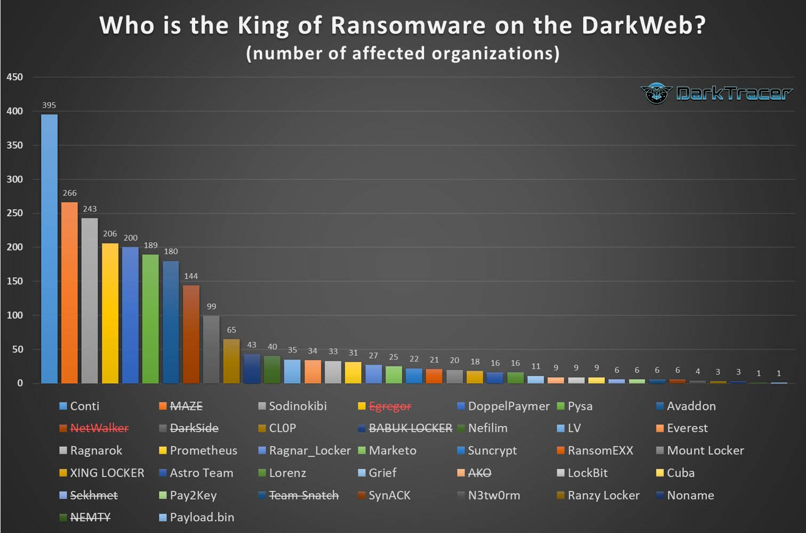
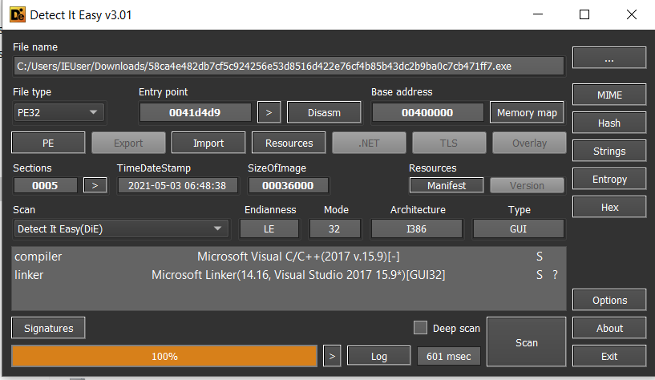
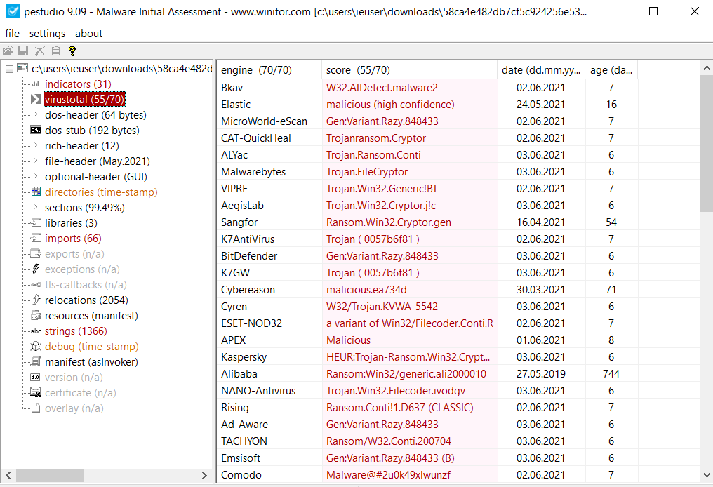
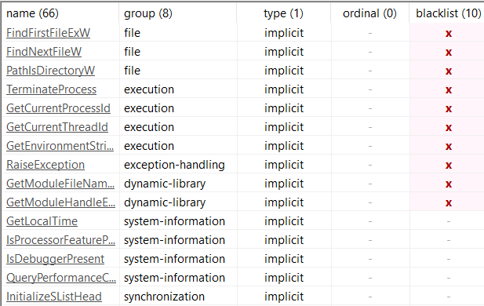
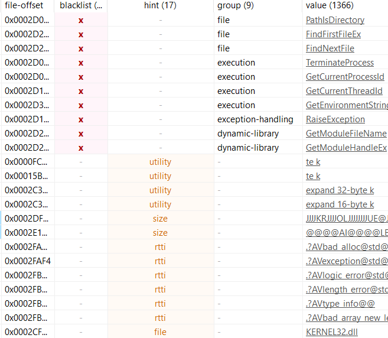
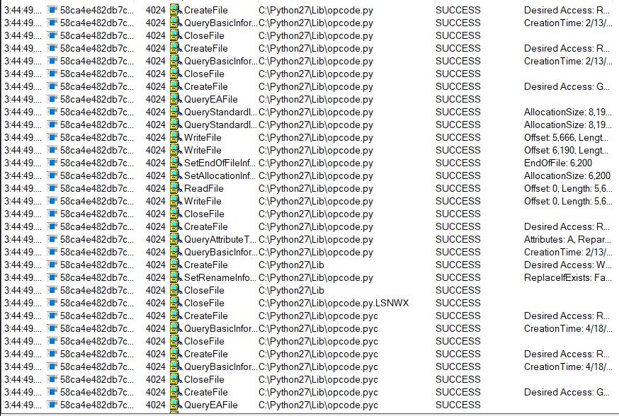

# Conti Ransomware

Conti Ransomware is one of the most brutal and biggest ransomware gangs at the moment. Not only Conti ranks in the number of victims but it also has the highest amout made in ransoms too.

Have alook into the stats from [Dark Tracer](https://twitter.com/darktracer_int)
So, without further due lets take a look into this malware.

## Static Analysis

The hash of the file is SHA - 58ca4e482db7cf5c924256e53d8516d422e76cf4b85b43dc2b9ba0c7cb471ff7.

First lets take a look if the executable is packed or unpacked using DiE...

It looks like our file in not indeed packed. So, lets have alook in the PEStudio.

Upon stern look on can say that this malware has VirusTotal 55/70 detection.
So, most of the Anti-Virus Solutions should be able to detect this variant.
Lets take a look in the Libraries being imported by the sample.

`kernel32.dll`, `user32.dll` & `shlwapi.dll` are imported.
Kernel32.dll in general has many important system API calls and functions that are helpful.
But it does have api calls that can be helpful to malware. And Similar applied to User32.dll and shlwapi.dll
But Shlwapi.dll is not used much in todays executables and shlwapi.dll is famous for havin a long list fo API's
and functions that are used by malware creators.

Now lets take a look at the functions and API callbacks being imported.

:warning: I have sorted the functions & API's being imported with blacklisted and type sort.
`FindFirstFileExW`, `FindNextFileW`, `PathIsDirectoryW` are generally related to file operations where ransomware takes the file
Encrypts the file in the directory.
`IsDebuggerPresent` Is used to find if there is any debugger present using PEB(Process Environment Block)64 which tells the malware if there is any debugger present and debuggers are bad for malware xD.
`Mite ATT&CK ID - U0122`
Sometimes `GetlocalTime` can be used for anti-debugging Technique - U0110
There are quite few important api's being used.

Now Lets take a look into the strings present in the executable.

:warning: So, again I have sorted it accordingly to explicit strings.
We can see it uses `PathIsDirectory`, `FindFirstFileEx` & `FindNextFile`, this generally indicates for first file discovery in a Directory and enumarating the next file in the Directory.
The rest are related to file execution and dynamic library loading and process injections.
Additional yet important func's used `SetUnhandledExceptionFilter - Anti-Debugging && Anti-Reversing` & `GetModuleHandleW`. 
I guess we are done with basic static analysis, now lets load the executable in a disassembler. 
In this case I used Cutter as it looks cool and I am broke :cry: :sob: to use IDA Pro.
Upon loading the executable with `aaa` mode. We can see multiple functions present. (I forgot to count the exact amount of functions :weary:)
Upon looking into the entry0 function which would be our point of entry for the malware.


I have put the function graph of the disassembled code. And there is alot going in these 2 images. So, hang on tight to reduce the P in the A of readers.
I have taken the P in the A and followed the functions and mentioned the important functions.

```
    fcn_0041d05f
    fcn_0041d091
    fcn_0041d16f
    fcn_0041d203
    fcn_0041d220 --> sub.KERNEL32.dll_InitializeSListHead_41da0a & sub.KERNEL32.dll_IsDebuggerPresent_41d71f
    fcn_0041d910
    fcn_0041d9b9 --> sub.KERNEL32.dll_GetSystemTimeAsFileTime_41d96c
    fcn_0041da6f
    fcn_0041da75
    fcn_0041f803 --> fcn.0041f6e8 --> sub.KERNEL32.dll_GetModuleHandleW_41d872 && sub.KERNEL32.dll_GetModuleHandleExW_41f790 && sub.KERNEL32.dll_GetCurrentProcess_41f74e
    fcn_0041f812 --> fcn.0041f6e8 --> sub.KERNEL32.dll_GetModuleHandleW_41d872 && sub.KERNEL32.dll_GetModuleHandleExW_41f790 && sub.KERNEL32.dll_GetCurrentProcess_41f74e
    fcn_0041f828 --> Error check kinda
    fcn_0041f84e
    fcn_0042026c --> fcn.004222e0 --> HeapAlloc && sub.KERNEL32.dll_GetOEMCP_422085 && sub.KERNEL32.dll_IsValidCodePage_4224ec && sub.KERNEL32.dll_HeapFree_4210b0
    fcn_004202bf
    fcn_00420306
```
```
    fcn_00403440
    fcn_004047c0 --> sub.KERNEL32.dll_SetUnhandledExceptionFilter_41cdc5
    fcn_00414ea0 --> sub.KERNEL32.dll_GetLocalTime_417910
    fcn_00417460 --> fcn.0041f36a --> KERNEL32.dll_IsProcessorFeaturePresent_41f387
    fcn_00417e20
    fcn_0041b310
    fcn_0041be90
    fcn_0041c970
    fcn_0041c9f0 --> fcn.41c7d0 --> PathIsDirectoryW(LPCWSTR, pszPath)
    fcn_0041ca60
    fcn_0041cb60
    fcn_0041cdb4 --> loc.0041cded --> sub.KERNEL32.dll_IsProcessorFeaturePresent
    fcn_0041ddb0
    fcn_0041f184 --> sub.KERNEL32.dll_HeapAlloc_421062
```
Now Just so you guys understand I have only highlighted the only functions that had direct mention of the functions. And while taking the Snippet I have missed the module where encryption algo is being run. sedlyf :sad:
It looks like the malware is looking if the debugger is present in many stages.

I am also attaching the entire disassebled code of entry0 function and main funnctions in this dir. 

Now let's move onto the dynmaic analysis part.

## Dynamic Analysis

Now that it has more than 3 stages of debugger detection my lazy ass instincts kicked in and I have skipped the entire
debugging part and fired up the API monitor, ProcMon, you guys might be wondaring why I haven't used any fakenet or network logging tools.
My laptop was already on fire after using cutter followed by API monitor and Procmon. (Potato PC :sad:)
API monitor didnt log any different API's other the one's mentioned in the static analysis. But ProcMon had many



My PC was so slow and and with sandbox was literally running on single digit frames. So, I missed some snips and moreover the filter UI in ProcMon is shit tho :-(.

We can see what the malware is doing with the python directory as it is not an important program that could potentially brick the system. So, nom nom time for the malware.
You can see `CreatFile`, `SetRenameInfo`, `WriteFile` is being used to encrypt the file opcode.py and omiting `opcode.py.LSNWX`.
But the malware interstingly didn't have any kill switch like URL or domain or file checks.

The ransomware note is left behind every encrypted folder and also on the desktop.


I have written the yara rule for Conti don't know the accuracy but it is something ratherthan nothing right?

You can find the [Yara_rules](https://github.com/Presidentsu/Yara_rules)

Thank you.

End of the File.