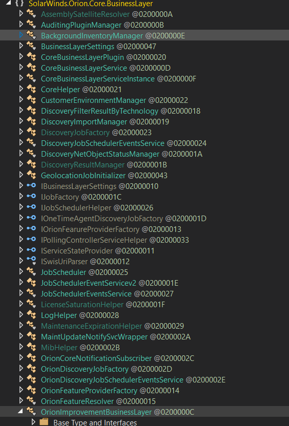
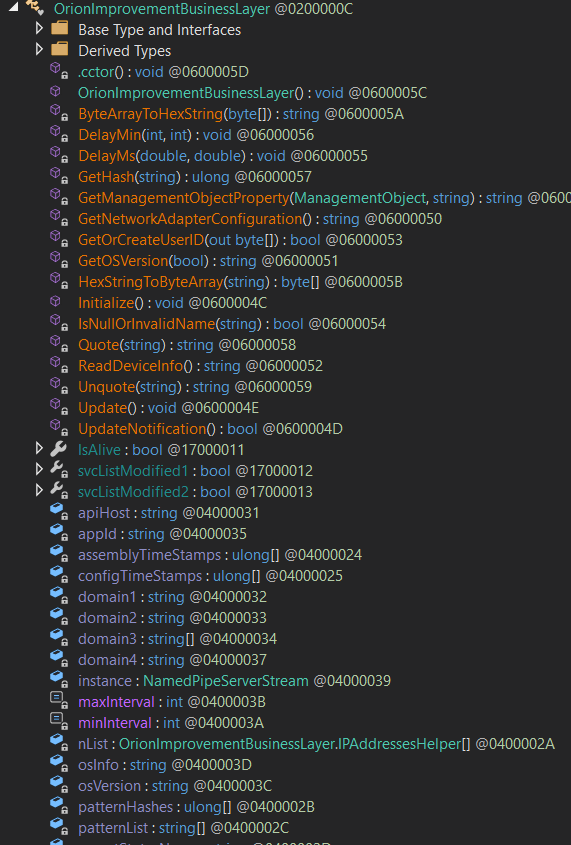
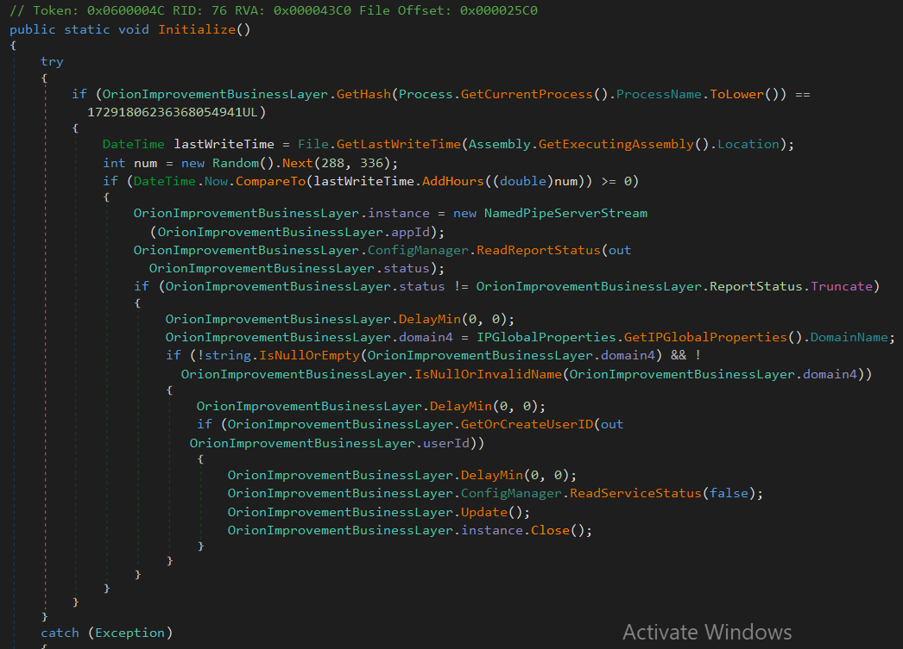

# Sunburst Backdoor

Late 13-12-2020 Fireeye released a threat report which we can say one of the most sophisticated espionage campaign by national threat actors that either are UNC2452(according to Fireeye) or APT24(according to vortex).

The .bin file I have in this repo has source to IoC(Indicator of Compromise) which was `SolarWinds.Orion.BusinessLayed.dll` which has malicous actors own code which was then certificate signed by SolarWinds themselves. Sad right they didn't knew someone had access put a malicous code inside their repo and no one recognized it XD 

So This .ddl is is built on .NET assembly so we can use any .NET decompilers like

`dnSpy`
`dotPeek`
`ILSpy`

I used dnSpy to decompile the dll.

We now go to Solarwinds.Orion.Core.BusinessLayer -> OrionImprovementBusinessLayer

Which was Sunbrust  backdoor now lets try to understand whats going on over there

Now we have many subclass being called in

So When we open any subclass code we see some base64 encoded strings. 

When I tried to base64 decode all I got was some random gibberish. 
So if we look once again we can see before being base64 encoded we see something called unzip function So if we look what function it is we can understand the string is first deflated and then its being base64 encoded so to get the string we need to first base64 decode it and then do raw inflate in CyberChef and we get that that string actually meant.

For the text given in the image.
`C07NSU0uUdBScCvKz1UIz8wzNooPriwuSc11KcosSy0CAA==` 
decodes to 
`Select * From Win32_SystemDriver`

How does this malware evades detection?

It runs some certain checks in initialize() function.

Which it first checks for the hard coded hash of the dll it self and if both are same then it checks for any changes to the entire codeblock for atleast 12-14 days.

If any of the above conditions didnt match it straight up kills the backdoor.

